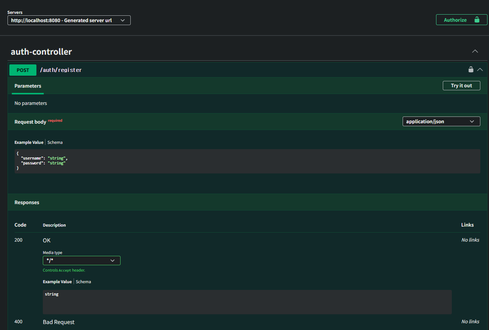
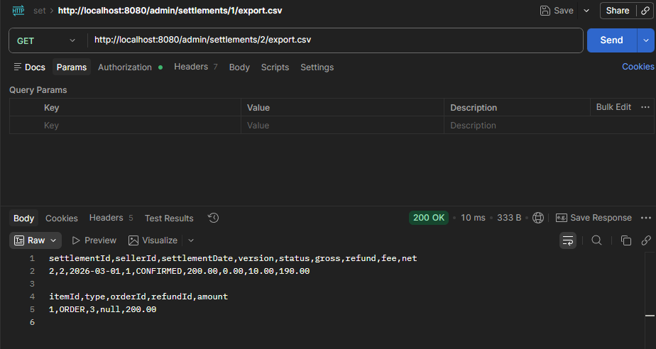

# Settlement Service

스프링 부트 기반의 일별 정산(Backoffice) 자동화 서비스로, 관리자 인증(JWT), OpenAPI(Swagger), Flyway 마이그레이션, 스프링 배치 기반의 `dailySettlementJob` 등을
포함한 실무형 애플리케이션입니다. 감사 로그와 재계산/버전 관리 등 정산 워크플로를 현실감 있게 구현합니다.

목차
-----

- 개요
- 기술 스택
- 빠른 실행(로컬/도커)
- 인증(JWT) 및 Spring Security
- OpenAPI(스웨거) 설정
- 배치(job): dailySettlementJob
- 주요 도메인/엔티티
- API 엔드포인트 요약
- 배치 적용 분석
- 보안 적용 분석
- 데이터베이스 및 마이그레이션
- 초기 관리자 계정
- 운영/보안 권장 사항
- 파일/코드 위치
- 예시: 로그인·요청
- 시나리오

개요
----
이 프로젝트는 일별 정산 계산(집계 → 확인 → 승인)과 관리자 백오피스를 제공하는 애플리케이션입니다. 정산 로직은 실제 운영에 근접하게 주문/환불 집계, 수수료/환불 계산, 버전 관리, 감사 로그 기록 등을
포함합니다. 또한 JWT 기반 인증을 통해 관리자 기능을 보호합니다.

기술 스택
---------

- 언어/플랫폼: Kotlin, Spring Boot 4
- DB: PostgreSQL (도커 컴포즈 구성에 포함)
- 마이그레이션: Flyway (src/main/resources/db/migration)
- 인증: JWT (io.jsonwebtoken/JJWT), Spring Security
- 배치: Spring Batch
- 컨테이너: Docker, Docker Compose

빠른 실행
---------
로컬 개발(Gradle)

```powershell
# 프로젝트 루트에서
./gradlew.bat clean build -x test
# 개발 프로파일로 실행
./gradlew.bat bootRun -Dspring.profiles.active=dev
```

Docker Compose (로컬 전체 스택)

```powershell
# 프로젝트 루트에서 (Windows PowerShell)
# 이미지 빌드와 컨테이너 기동
docker-compose up --build
# 백그라운드로 띄우려면
docker-compose up -d --build
```

JWT & Spring Security (구현 상세)
---------------------------------
이 프로젝트는 JWT 기반 인증을 사용합니다.

### 핵심 설정

- 프로퍼티 위치: `src/main/resources/application*.yml`
- 주요 키: `app.jwt.secret`, `app.jwt.issuer`, `app.jwt.access-token-minutes`
- 실행 환경에서는 레포지토리에 시크릿을 두지 말고 환경변수(`APP_JWT_SECRET`)로 주입하세요.

### 핵심 컴포넌트

- `JwtTokenProvider` — 토큰 생성 및 파싱(라이브러리: io.jsonwebtoken)
    - 토큰에 issuer, subject(username), issuedAt, expiration을 포함
    - claim으로 역할(role) 정보 등을 포함할 수 있음
- `JwtAuthenticationFilter` — Authorization 헤더(`Bearer <token>`)를 파싱해 SecurityContext에 Authentication을 설정
- `SecurityConfig` — SecurityFilterChain 설정
    - CSRF 비활성화, 세션 무상태(STATELESS)
    - 허용 경로: `/auth/**`, `/swagger-ui/**`, `/v3/api-docs/**` 등
    - `PasswordEncoder`는 `BCryptPasswordEncoder` 사용
- `UserDetailsService`는 `AdminUserRepository`로부터 사용자 로드

OpenAPI (Swagger) 구성
----------------------


- OpenAPI 설정 파일: `src/main/java/nuts/commerce/settlement/common/config/OpenApiConfig.java`
    - Bearer 인증 스킴(`bearerAuth`)을 전역 보안 요구사항으로 등록
    - 결과: Swagger UI에서 Authorize 버튼을 통해 JWT를 입력 가능
- 프로덕션 주의: Swagger UI 및 API 문서 엔드포인트(`/swagger-ui/**`, `/v3/api-docs/**`)는 기본적으로 허용되어 있으므로 운영 환경에서는 인증 또는 프로파일 기반 접근 제한을
  필요하다.

배치: dailySettlementJob
------------------------
목적: 특정 날짜 기준으로 판매자별 정산을 계산해 `Settlement` 및 `SettlementItem`을 생성.

동작 요약

- JobParameter: `settlementDate` (옵션, 없으면 기본값=어제)
- 각 판매자에 대해 주문/환불을 집계
- 수수료·환불·총액·순액 계산 후 `Settlement` 생성(상태: CALCULATED)
- 오류 발생 시 해당 판매자 단위로 `AuditLog`를 남기고 다른 판매자는 계속 처리
- 관리자는 계산된 정산을 확인 후 승인하면 상태를 CONFIRMED(confirmedAt/confirmedBy 기록)

수동 실행(예시)

```powershell
# 예: 하루치 정산(2026-03-01) 수동 실행
./gradlew.bat bootRun --args='--spring.batch.job.names=dailySettlementJob --spring.batch.job.parameters=settlementDate=2026-03-01'
```

주요 도메인/엔티티
------------------

- Settlement: sellerId, settlementDate, totalAmount, feeAmount, refundAmount, netAmount, status, version
- SettlementItem: orderId, type(PAYMENT/REFUND), amount, fee
- AuditLog: operation, entityType, entityId, message, createdBy, createdAt
- AdminUser: username, passwordHash, roles

API 엔드포인트(주요)
--------------------

- POST /auth/register — 관리자 등록 (body: { username, password })
- POST /auth/login — 로그인 (body: { username, password }) → 반환: { accessToken }
- GET /admin/settlements — 정산 요약(검색/페이징)을 조회합니다.
- GET /admin/settlements/{id} — 특정 정산의 기본 메타 정보를 조회합니다.
- GET /admin/settlements/{id}/items — 정산에 포함된 항목(주문/환불)을 조회합니다.
- POST /admin/settlements/confirm — 계산된 정산을 승인합니다.
- POST /admin/settlements/rerun — 특정 판매자·날짜에 대해 정산을 재실행합니다.
- GET /admin/settlements/{id}/export.csv — 정산 결과를 CSV로 다운로드합니다.
- CRUD (관리자용): /admin/sellers, /admin/orders, /admin/refunds — 관리·테스트용 엔드포인트

간단 로그인 예시

```bash
curl -X POST http://localhost:8080/auth/login \
  -H "Content-Type: application/json" \
  -d '{"username":"admin1","password":"password1"}'
# 응답: {"accessToken":"eyJ..."}
```

배치 적용 분석
--------------

### 프로젝트 내 기술적 가치

- 설계·구현: Spring Batch를 사용해 대용량의 정산 작업(주기적/일괄 처리)을 안정적으로 처리하도록 설계했습니다. Chunk 기반 처리와 트랜잭션 경계 설정으로 실패 시 재시도/재시작이 가능하며,
  ItemReader/Processor/Writer 패턴을 통해 비즈니스 로직을 모듈화했습니다.
- 운영·검증: Job/Step 실행 상태는 Spring Batch 메타테이블에 기록되어 재시작 및 모니터링이 가능하고, Spring Boot Actuator와 결합해 운영 지표와 헬스체크를 제공합니다.

### 핵심 파일

`DailySettlementJobConfig.java`
`DailySettlementTasklet.java`
`BatchController.java`
`SettlementCommandService`

### 핵심 파일 상세

`DailySettlementJobConfig.java`

```
@Bean
public Job dailySettlementJob(JobRepository jobRepository, Step dailySettlementStep) {
    return new JobBuilder("dailySettlementJob", jobRepository)
            .start(dailySettlementStep)
            .build();
}
```

- `dailySettlementJob`을 JobRepository 기반으로 선언하고, `dailySettlementStep`을 시작점으로 구성합니다. `@EnableBatchProcessing`으로 Spring
  Batch 인프라가 자동 구성됩니다.

검증 방법:

- 애플리케이션 실행 후 `BATCH_JOB_INSTANCE`에 `dailySettlementJob`이 등록되는지 확인

`DailySettlementTasklet.java`

```
String dateStr = (String) chunkContext.getStepContext().getJobParameters().get("settlementDate");
LocalDate date = (dateStr == null || dateStr.isBlank()) ? LocalDate.now().minusDays(1) : LocalDate.parse(dateStr);

sellerRepository.findAll().forEach(seller -> {
    boolean exists = settlementRepository.findTopBySellerIdAndSettlementDateOrderByVersionDesc(seller.getId(), date).isPresent();
    if (!exists) settlementCommandService.calculateDaily(seller.getId(), date, 1, "batch");
});
```

- JobParameter인 `settlementDate`를 파싱해 대상 날짜를 결정한 뒤, 판매자들을 순회하며 기존 정산 존재 여부를 체크하고 없다면
  `SettlementCommandService.calculateDaily`로 정산을 수행합니다. 예외 발생 시 Audit 기록을 남깁니다.

검증 방법:

- 소량의 테스트 데이터로 Tasklet 실행 후 `Settlement`와 `SettlementItem`이 생성되는지 확인
- 실패 케이스에서 AuditService 호출 여부 확인

`BatchController.java`

```
JobParameters jobParameters = new JobParametersBuilder()
        .addString("settlementDate", date.toString())
        .addLong("run.id", System.currentTimeMillis())
        .toJobParameters();

JobExecution execution = jobOperator.start(dailySettlementJob, jobParameters);
```

- 관리자 엔드포인트(`/admin/batch/daily-settlement`)에서 `JobOperator`로 `dailySettlementJob`을 수동 트리거합니다. `run.id`로 유니크 파라미터를 생성해
  중복 실행 문제를 방지합니다.

검증 방법:

- API 호출로 Job이 시작되는지와 반환된 `JobExecution` ID를 통해 실행 이력을 조회

`SettlementCommandService.java`

```
List<Order> orders = orderRepository.findBySellerIdAndPaidAtBetween(sellerId, from, to);
List<Refund> refunds = refundRepository.findBySellerIdAndRefundedAtBetween(sellerId, from, to);

Settlement settlement = new Settlement(seller, date, version);
settlementRepository.save(settlement);
```

- 주어진 판매자와 날짜 범위에서 주문·환불을 조회해 `Settlement` 및 `SettlementItem`을 생성·저장하고, 수수료 계산 후 `markCalculated`로 상태를 반영합니다. 모든 변경은
  `@Transactional`로 묶여 원자성을 보장합니다.

검증 방법:

- 다양한 주문/환불 케이스로 `calculateDaily`의 결과(총액, 환불, 수수료, 순수액)가 기대값과 일치하는지 단위/통합 테스트

`SettlementRepository.java`

```
Optional<Settlement> findTopBySellerIdAndSettlementDateOrderByVersionDesc(Long sellerId, LocalDate settlementDate);

List<Settlement> findBySettlementDateAndStatus(LocalDate settlementDate, SettlementStatus status);
```

- 정산의 최신 버전 조회와 날짜별 상태 조회 등 배치 프로세스에서 필요한 쿼리를 제공하는 JpaRepository 확장입니다.

검증 방법:

- 테스트 DB에서 각 쿼리가 올바른 레코드를 반환하는지 검증

`SellerRepository.java`

```
public interface SellerRepository extends JpaRepository<Seller, Long> {}
```

- 판매자 목록 조회를 단순화하기 위한 JpaRepository입니다. Tasklet에서 `findAll()`로 모든 판매자를 순회합니다.

검증 방법:

- 테스트 데이터로 `findAll()` 반환값을 확인

배치 처리 흐름
--------------

1. 대상 추출(Reader): 미처리 주문을 조회
2. 변환(Processor): 수수료·정책 적용, 예외 판정
3. 적재(Writer): 정산 결과를 일괄 저장
4. 후처리(Listener): 집계, 알림, Job 상태 정리

배치 추후 개선 사항
-------------

- 확장성: 대용량 처리 시 파티셔닝(partitioning)이나 병렬 Step을 도입해 처리량을 확보
- 안정성: 재시작성(idempotency) 보장, 실패 시 재시도/스킵 정책(tolerant skip/retry) 적용
- 운영: Job 모니터링 대시보드(예: Spring Batch Admin 또는 커스텀 UI)와 알림(실패 시 슬랙/메일) 연동
- 보안: 민감 데이터(예: 결제 정보)는 마스킹·암호화하고, 배치에 사용하는 DB 계정의 권한을 최소화

---

보안 적용 분석
----------------

프로젝트 내 기술적 가치

- 설계·구현: JWT 기반 무상태 인증을 도입해 확장성과 보안성을 확보했습니다. Spring Security FilterChain에 커스텀 JWT 필터를 삽입하고, 비밀번호는 BCrypt로 해시하여 안전하게
  저장했습니다.
- 운영·검증: 정산 시스템의 관리자 API 접근 제어와 감사(audit) 기록을 통해 운영 신뢰성을 제공하며, OpenAPI/Swagger 기반 문서화로 수동 검증을 지원합니다.

핵심 파일
---------
`SecurityConfig.java`, `AuthController.java`, `AdminUser.java`, `AdminUserRepository.java`, `DataInitializer.java`,
`jwt/JwtTokenProvider.java`, `jwt/JwtAuthenticationFilter.java`, `OpenApiConfig.java`

핵심 파일 상세
-----------------

`SecurityConfig`

```
http.csrf().disable();
http.sessionManagement().sessionCreationPolicy(SessionCreationPolicy.STATELESS);
http.authorizeHttpRequests(auth -> auth.requestMatchers("/auth/**").permitAll().anyRequest().authenticated());
http.addFilterBefore(new JwtAuthenticationFilter(tokenProvider), UsernamePasswordAuthenticationFilter.class);
return http.build();
```

- Stateless JWT 기반 인증을 적용하고, 인증 필터를 SecurityFilterChain에 등록해 모든 요청에서 토큰을 검증하도록 구성했습니다.

검증 방법:

- 보호된 엔드포인트에 인증 없이 접근 시 401 응답 확인
- 테스트에서 SecurityContext에 인증 정보가 설정되는지 확인

`AuthController`

```
String hash = passwordEncoder.encode(req.password());
adminUserRepository.save(new AdminUser(req.username(), hash));

AdminUser user = adminUserRepository.findByUsername(req.username()).orElseThrow();
if (passwordEncoder.matches(req.password(), user.getPasswordHash()))
    return tokenProvider.createAccessToken(user.getUsername());
```

- 관리자 등록은 BCrypt 해시로 비밀번호를 저장하고, 로그인 성공 시 JWT를 발급합니다.

검증 방법:

- DB에 저장된 passwordHash가 평문이 아닌지 확인
- 발급된 토큰을 파싱하여 subject가 올바른지 확인

`JwtTokenProvider`

```
String token = Jwts.builder()
    .issuer(issuer)
    .subject(username)
    .issuedAt(now)
    .expiration(exp)
    .claim("role","ADMIN")
    .signWith(key)
    .compact();
String username = Jwts.parser().verifyWith(key).build().parseSignedClaims(token).getPayload().getSubject();
```

- HMAC 서명을 사용한 JWT 발급 및 파싱을 통해 토큰 위·변조를 방지하고, 간단한 클레임 기반 권한 확장 준비를 했습니다.

검증 방법:

- 서명이 변조된 토큰으로 접근 시 파싱 실패로 거부되는지 확인
- 토큰 만료 시 401 응답 확인

`JwtAuthenticationFilter`

```
String auth = request.getHeader(HttpHeaders.AUTHORIZATION);
if (auth != null && auth.startsWith("Bearer ")) {
    String token = auth.substring(7);
    String username = tokenProvider.parseUsername(token);
    SecurityContextHolder.getContext().setAuthentication(
        new UsernamePasswordAuthenticationToken(username, null, List.of(new SimpleGrantedAuthority("ROLE_ADMIN"))));
}
filterChain.doFilter(request, response);
```

- 요청의 Authorization 헤더에서 Bearer 토큰을 추출해 파싱한 후 SecurityContext에 인증 정보를 설정합니다. 현재는 ADMIN 권한을 부여합니다.

검증 방법:

- 유효 토큰으로 보호 API 호출 시 인증 통과 여부 확인
- 토큰의 role(claim) 기반 권한 매핑 필요성 검토

`AdminUser / AdminUserRepository`

```
@Column(nullable = false, length = 80)
private String username;

@Column(name = "password_hash", nullable = false, length = 200)
private String passwordHash;
```

- 관리자 계정의 최소 필드를 저장하며 username에 유니크 제약을 적용했습니다.

검증 방법:

- `findByUsername`로 사용자 조회 시 올바른 엔티티 반환 확인

`DataInitializer`

```
@EventListener(ApplicationReadyEvent.class)
public void init() {
    createIfNotExists("admin1", "password1");
}
```

- 개발/시연 환경에서 기본 관리자 계정을 자동 생성해 재현성을 확보하도록 구성했습니다.

검증 방법:

- 애플리케이션 시작 후 DB에 초기 계정 존재 여부 확인

`OpenApiConfig`

```
new Components().addSecuritySchemes("bearerAuth",
    new SecurityScheme().type(SecurityScheme.Type.HTTP).scheme("bearer").bearerFormat("JWT"));
```

- OpenAPI에 Bearer JWT 스키마를 등록해 Swagger UI에서 토큰 입력을 통한 수동 테스트를 지원합니다.

검증 방법:

- Swagger UI에서 토큰 입력 후 보호 API 호출 가능 여부 확인

인증 흐름 요약
--------------

1. `POST /auth/register` — PasswordEncoder로 비밀번호 해시 저장
2. `POST /auth/login` — 인증 성공 시 JwtTokenProvider로 액세스 토큰 발급
3. 보호된 엔드포인트 요청 시 JwtAuthenticationFilter가 토큰을 파싱해 SecurityContext에 인증 정보를 설정

인증 추후 개선 사항
-------------------

- `app.jwt.secret`을 환경변수 또는 비밀관리 시스템으로 이전
- 인증/인가 실패에 대한 표준화된 JSON 응답 포맷 도입
- DataInitializer를 개발 전용 프로파일로 제한
- Refresh token 또는 토큰 무효화(블랙리스트) 전략 검토

시나리오
----------------------------------

- 핵심 흐름: 로그인 → 정산 조회(기간/판매자 필터) → 정산 승인 → CSV 다운로드
- 주요 엔드포인트: POST /auth/login, GET /admin/settlements, POST /admin/settlements/confirm, POST /admin/settlements/rerun,
  GET /admin/settlements/{id}/export.csv
  

### 시나리오 1 — 운영자 로그인 → 정산 목록 조회 → 정산 승인

- 목적: 관리자 인증, 검색(필터링·페이징), 승인 액션의 전체 플로우를 보여주기 위함.
- 흐름:
    1. 관리자 로그인으로 JWT 수신
    2. 정산 요약 조회(기간/판매자 필터)로 대상 정산 식별
    3. 특정 정산 선택 후 /admin/settlements/confirm 호출로 승인
- 기대 결과: 승인된 정산은 상태가 CONFIRMED로 변경되고, confirmedBy/confirmedAt이 기록됩니다.
- 기술적 의의:
    - Stateless JWT 인증 적용으로 운영 확장성과 세션 오버헤드 감소
    - 도메인 모델(Allocation: Settlement/SettlementItem)로 합계 계산 책임을 분리
    - 승인 로그(Audit)로 변경 내역 추적 및 운영 신뢰성 확보
- 검증 포인트:
    - 승인 전/후의 상태(status, confirmedBy, confirmedAt)과 관련 로그를 확인
    - 승인 처리 후 생성되는 감사 레코드의 존재 및 정확성 확인

### 시나리오 2 — 주문·환불 생성 → 정산 재실행(재계산) → 결과 검증

- 목적: 데이터 변경이 정산 결과에 미치는 영향을 시연하고 재실행 idempotency/버전 관리를 강조.
- 흐름:
    1. 테스트 판매자에 주문 생성(POST /admin/orders)
    2. 필요 시 환불 생성(POST /admin/refunds)
    3. /admin/settlements/rerun 호출로 해당 판매자·날짜 정산 재실행
    4. 재계산 결과 확인(정산 요약·상세·items) 및 CSV 다운로드
- 기대 결과: 재계산 결과는 새로운 버전으로 생성되거나 기존 버전이 업데이트되어 금액이 반영됩니다.
- 기술적 의의:
    - 재실행 시 버전 관리를 통해 idempotency 보장 및 중복 집계 방지
    - 배치의 부분 실패 허용 설계로 전체 작업의 가용성 유지
- 검증 포인트:
    - 재실행 전/후의 금액 합계(총액/환불/수수료/순액)과 version 증가 여부 검증
    - 실패 케이스가 AuditLog에 기록되고 다른 판매자는 정상 처리되는지 확인

### 시나리오 3 — 정산 CSV 내보내기(운영 보고용) 및 데이터 소비

- 목적: 운영자/재무가 활용할 수 있는 CSV 추출과 포맷을 시연.
- 흐름:
    1. 특정 정산 선택
    2. /admin/settlements/{id}/export.csv 호출로 CSV 다운로드
    3. CSV를 열어 요약 행(정산 메타)과 항목(rows)을 검토
- 기대 결과: CSV에 정산 요약과 항목이 포함되어 엑셀 리포트나 외부 시스템과 연동 가능
- 기술적 의의:
    - CSV 추출로 운영·재무팀의 데이터 소비를 직접 지원
    - 대용량 처리 시 스트리밍 방식으로 확장 가능하도록 설계 고려
- 검증 포인트:
    - CSV 헤더·요약·항목 수가 예상치와 일치하는지 확인
    - CSV 파일의 데이터 무결성을 엑셀 등으로 검증

### 시나리오 4 — 관리자·판매자 관리 및 권한 검토(보안 포인트)

- 목적: 관리 UI 호출과 권한(인증 흐름) 설계를 설명하고 보안 요소를 부각.
- 흐름:
    1. 관리자 등록/로그인
    2. /admin/sellers로 판매자 등록/조회
    3. 권한이 없는 요청(토큰 없음 또는 잘못된 토큰) 시 401 응답 시연
- 기대 결과: 관리자 기능 접근 및 데이터 조작에 대한 권한 통제가 적절히 이루어짐.
- 기술적 의의:
    - BCrypt 기반 비밀번호 해시 적용으로 인증 보안 확보
    - 초기 계정 자동 생성으로 데모 재현성 제공
    - 토큰 권한 검증 및 시크릿 관리 개선은 향후 보안 강화 대상
- 검증 포인트:
    - 인증되지 않은 요청 또는 잘못된 토큰에 대해 401 응답을 확인
    - AdminUser 테이블에 저장된 비밀번호가 해시인지 확인

초기 관리자 계정 (개발용)
-----------------------
앱 시작 시 `DataInitializer`가 기본 관리자 계정을 생성합니다(개발 편의).

- 예시 계정: `admin1` / `password1`, `admin2` / `password2`
  운영 환경에서는 초기 계정 생성 여부를 제어하거나 바로 교체/삭제하세요.

파일/코드 위치
------------------

- JWT/시큐리티: `src/main/java/nuts/commerce/settlement/security` (예: `JwtTokenProvider`, `JwtAuthenticationFilter`,
  `SecurityConfig`, `DataInitializer`)
- OpenAPI 설정: `src/main/java/nuts/commerce/settlement/common/config/OpenApiConfig.java`
- Batch 설정/Tasklet: `src/main/java/.../domain/batch` (예: `DailySettlementTasklet`)
- 엔티티: `src/main/java/.../domain/model` (Settlement, SettlementItem, AuditLog, AdminUser)
- Flyway 스크립트: `src/main/resources/db/migration`
- Docker Compose: 프로젝트 루트의 `docker-compose.yml`

예시: 로그인 → 인증된 요청
-------------------------

1) 로그인

```bash
curl -X POST http://localhost:8080/auth/login -H "Content-Type: application/json" -d '{"username":"admin1","password":"password1"}'
```

응답 예시

```json
{
  "accessToken": "eyJhbGciOiJI..."
}
```

2) 인증된 요청 (예: 정산 승인)

```bash
curl -X POST http://localhost:8080/api/settlements/{id}/confirm -H "Authorization: Bearer eyJhbGciOiJI..."
```

